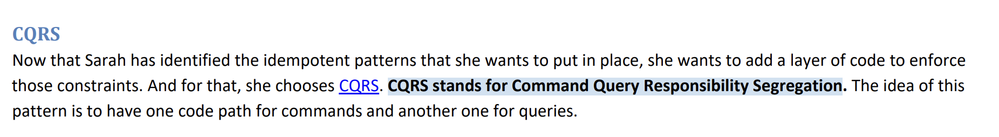

# Notes DLS

### Related projects from Course / pesekt1

`Microservices-scaling` -> https://github.com/pesekt1/microservices-scaling
`RabbitMQ-Microservices` -> https://github.com/pesekt1/RabbitMQ-Microservices

 

---

 

# Misc

CQRS - Command Query Responsibility Segregation

#### HTTP STATUS CODES 
